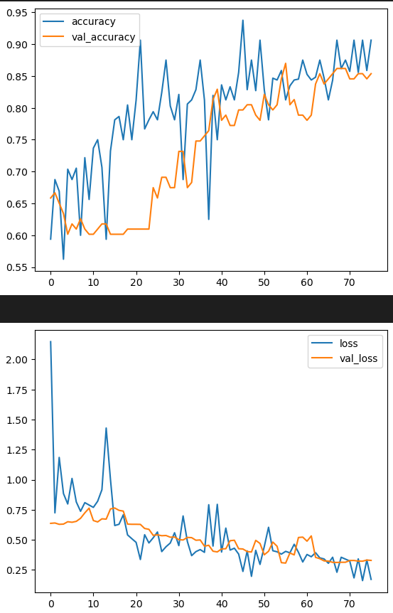
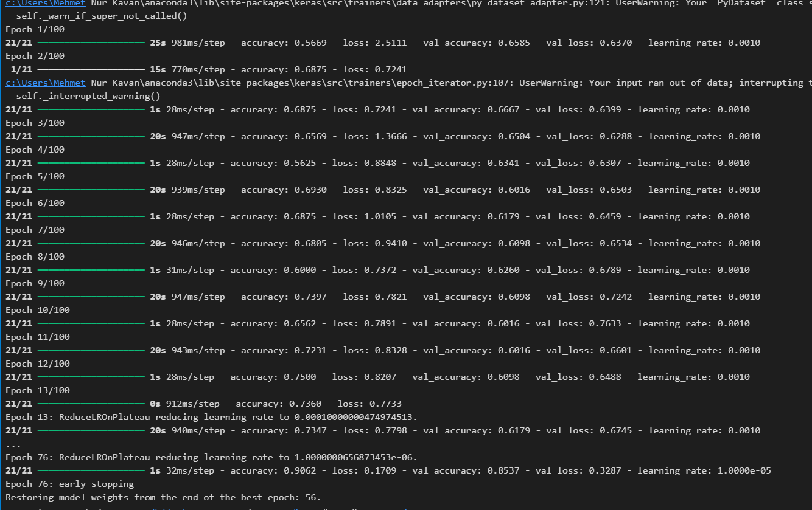
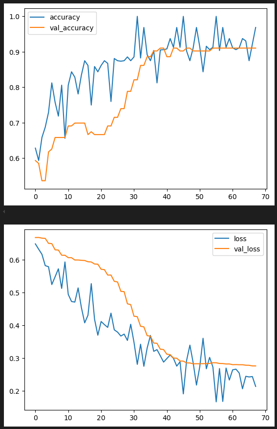
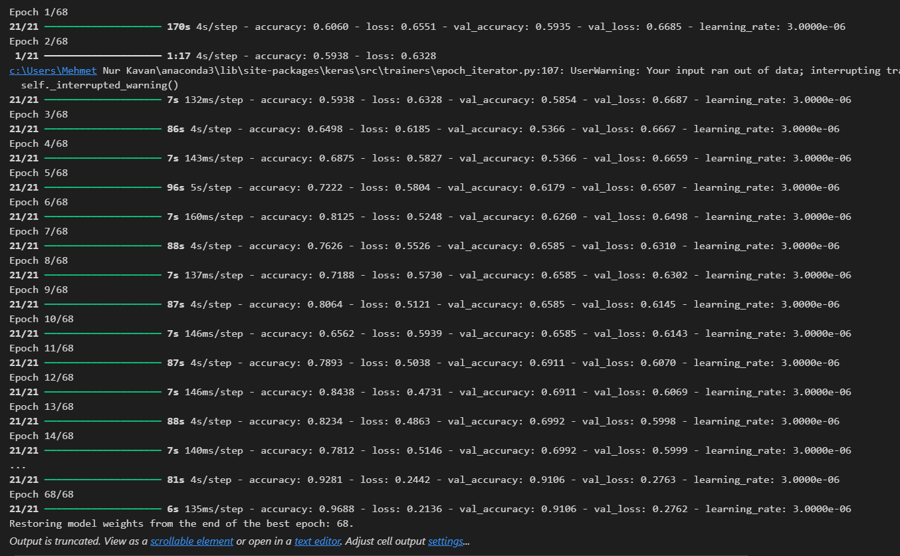

# Katarakt Tespiti Projesi

Bu proje, EfficientNetB0 modelini kullanarak katarakt tespiti yapmayı amaçlayan bir görüntü sınıflandırma modelidir. Model, göz görsellerini analiz ederek katarakt hastalığının varlığını veya yokluğunu tespit eder.

## Yapılanlar

Bu proje, katarakt hastalığını tespit etmek amacıyla geliştirilmiştir. Aşağıdaki adımlar takip edilmiştir:

### 1. Veri Hazırlığı ve Önişleme
- **Veri Setleri**:
  - **CataractDataset**: [Kaggle Cataract Dataset](https://www.kaggle.com/datasets/jr2ngb/cataractdataset). Bu veri seti, 4 farklı göz hastalığını içeren görsellerden oluşmaktadır. Burada, katarakt hastalığına dair görsellerin bulunduğu sınıf kullanılmıştır.
  - **Ocular Disease Recognition (ODIR5K)**: [Kaggle Ocular Disease Recognition Dataset](https://www.kaggle.com/datasets/andrewmvd/ocular-disease-recognition-odir5k). Bu veri seti, göz hastalıklarını tanımak için kullanılan 5.000 görsellik bir veri setidir. Eğitim ve test verisi ayrı olarak verilmiştir.
- **Veri Temizliği**: Görsellerin boyutları standardize edilmiş ve normalizasyon işlemi yapılmıştır.
- **Veri Augmentasyonu**: Modelin genelleme yeteneğini artırmak için veri augmentasyonu yapılmıştır (dönme, ölçekleme, yatay çevirme vb.).

### 2. Model Tasarımı
- **Model Seçimi**: **EfficientNetB0** kullanılarak yüksek doğruluk sağlayan bir model tasarlanmıştır. EfficientNetB0, verimli ve güçlü performans sergileyen bir model olup, görüntü sınıflandırma görevlerinde oldukça başarılıdır.
- **Katman Yapısı**: EfficientNetB0'in önceden eğitilmiş (pre-trained) ağı, katarakt tespiti için transfer öğrenme yöntemiyle kullanılmıştır.
- **Öğrenme Oranı ve Optimizer**: Adam optimizer kullanılarak eğitim süreci hızlandırılmış ve öğrenme oranı optimize edilmiştir.

### 3. Model Eğitimi
- **Eğitim Verisi**: Model, eğitim veri seti üzerinde eğitilmiştir. Eğitim sırasında, kayıp fonksiyonu olarak 'binary crossentropy' kullanılmıştır.
- **Başarı Oranı**: Modelin doğruluk oranı, doğrulama veri seti üzerinde ölçülmüştür.

### 4. Sonuçlar ve Performans
- **Eğitim ve Test Sonuçları**: Modelin doğruluk oranı test edilmiştir ve sonuçlar görsel olarak sunulmuştur.
- **Grafikler**: Modelin eğitim süreci ve doğruluğu ile ilgili grafikler hazırlanmıştır.

## Kullanılan Teknolojiler
- **Python**: Proje geliştirilmesinde Python kullanılmıştır.
- **TensorFlow ve Keras**: EfficientNetB0 modeli ve derin öğrenme yöntemleri için TensorFlow ve Keras kütüphaneleri kullanılmıştır.
- **NumPy, Pandas, Matplotlib**: Veri işleme ve görselleştirme için bu kütüphaneler kullanılmıştır.

## Proje Grafikleri/ Model Accuracy - Epochs, Model Loss - Epochs

Aşağıda, modelin eğitim süreci ve doğruluğuna dair grafikler bulunmaktadır:

*ilk model*






*efficientNetB0 ile*





**

Projenin çalışabilmesi için aşağıdaki komutları kullanarak gerekli kütüphaneleri kurabilirsiniz:

```bash
pip install tensorflow numpy matplotlib
